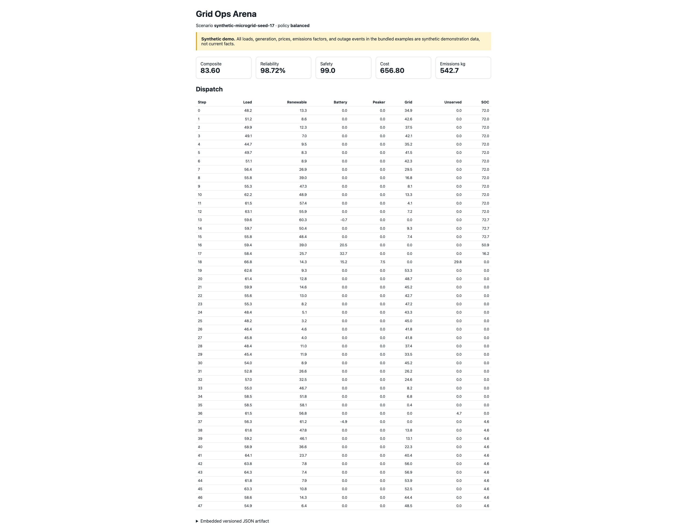

# Grid Ops Arena

Grid Ops Arena is a deterministic, zero-runtime-dependency microgrid simulator for testing dispatch policies under synthetic load, renewable generation, battery limits, peaker constraints, price changes, and outages.

> **Data boundary:** every bundled load, generation, price, emissions factor, and event is synthetic. Nothing here is presented as a current climate, market, or grid fact.



## Problem

Agent demos often optimize a single number while silently violating power, energy, or availability constraints. Grid Ops Arena gives an agent a small versioned action protocol, enforces physical limits, and scores reliability, cost, emissions, and safety from the same replayable scenario.

## Proof

- Seeded scenarios produce byte-equivalent JSON results.
- Battery state of charge and power, peaker capacity, and equipment availability are enforced at every step.
- Three inspectable baseline policies provide controls.
- Reports share a stable `1.0.0` artifact schema in JSON, Markdown, and single-file HTML.
- Scenario readers require the exact versioned root, series, and configuration fields; missing and unknown fields fail closed.
- Every derived multiplication and accumulation is checked for finite output before it can reach an artifact.
- Report bundles are staged and rolled back as a set; cooperating writers hold an exclusive advisory directory lock so their files cannot mix, and output-directory links and pre-existing report links are rejected rather than followed.
- Unit and subprocess integration tests run with the Python standard library.

## 60-second demo

```bash
python3 -m venv .venv
. .venv/bin/activate
python -m pip install -e .
grid-ops-arena demo --seed 17 --hours 48 --policy balanced --output-dir reports
open reports/grid_ops_report.html  # macOS; use your browser elsewhere
```

Without installation:

```bash
PYTHONPATH=src python -m grid_ops_arena demo --output-dir reports
```

Run the checked-in scenario:

```bash
grid-ops-arena run --scenario examples/synthetic_scenario.json --policy resilience
```

Invalid schemas or arithmetic that would produce a non-finite derived value return CLI exit code `2` and do not emit a partial report.

## Architecture

```text
versioned scenario -> observation -> policy -> Action
        |                                      |
        +---------- simulator + limits <-------+
                           |
                    score + step trace
                           |
                  JSON / Markdown / HTML
```

See [docs/architecture.md](docs/architecture.md) and [docs/limitations.md](docs/limitations.md).

## Release materials

- [Research and differentiation](docs/research.md)
- [Roadmap](ROADMAP.md)
- [AI-assisted development disclosure](AI_ASSISTED.md)
- [Citation metadata](CITATION.cff)
- Golden demo: [HTML](artifacts/demo/grid_ops_report.html), [Markdown](artifacts/demo/grid_ops_report.md), [JSON](artifacts/demo/grid_ops_report.json)

## Agent action protocol

Policies receive a plain dictionary observation and return `Action(battery_kw, peaker_kw, rationale)`. Positive battery power discharges; negative power charges. Requested actions are preserved in the trace while physically feasible actions are separately recorded.

## Development

```bash
make test
make demo
make golden
python -m pip install build==1.5.0
release_dir="$(mktemp -d)"
python -m build --sdist --outdir "$release_dir"
python scripts/check_sdist.py "$release_dir"/*.tar.gz
```

The source-distribution check rejects unsafe or cache/build entries, verifies that examples and golden fixtures are present, extracts the archive, and runs its complete embedded test suite.

## Limits

This is an educational dispatch arena, not a production optimal-power-flow, protection, capacity-planning, or market-settlement system. See the full limitations document before interpreting results.

MIT licensed. Contributions should follow [CONTRIBUTING.md](CONTRIBUTING.md).
